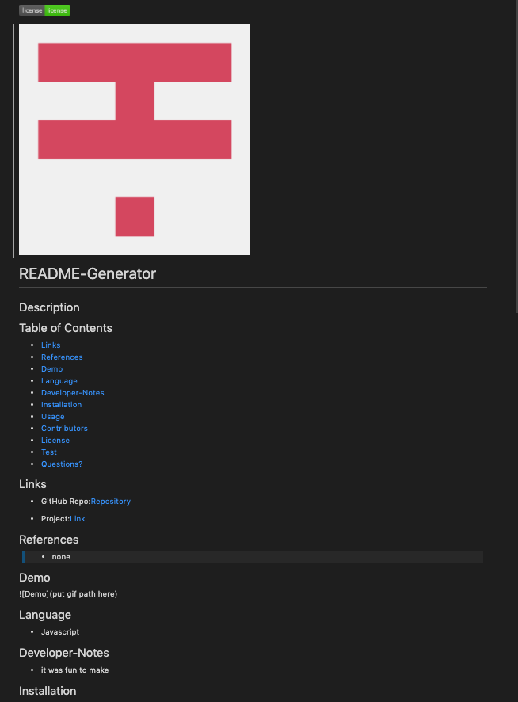

# README-Generator

## Description
* Generates a ReadMe for developers through the terminal using node.

## Table of Contents

* [Links](#Links)
* [Installation](#Installation)
* [Usage](#Usage)
* [Demo](#Demo)
* [Language](#Language)
* [Reference](#Reference)
* [License](#License)

## Demo

  
  
## Demo Pic

  

## Links

* Project Repo: [Repository](https://github.com/jonesliddy77/README-Generator)

## Installation
``` 
npm i 
```  
``` 
node index.js 
```
```
npm i axios
```
## Usage
Open up terminal in VScode, make sure you are in the right pash then type node index.js. After the questions are answers the ReadME me generate.

## Language

* JavaScript


## Reference

These are the websites I used as references: 

> - [Developer Mozilla](https://developer.mozilla.org/en-US/)
> - [W3School](https://www.w3schools.com/) 
> - [StackOverflow](https://www.stackoverflow.com/) 
> - [npm](https://www.npmjs.com/) 

## License

MIT © [Jones Liddy](https://github.com/jonesliddy77)


